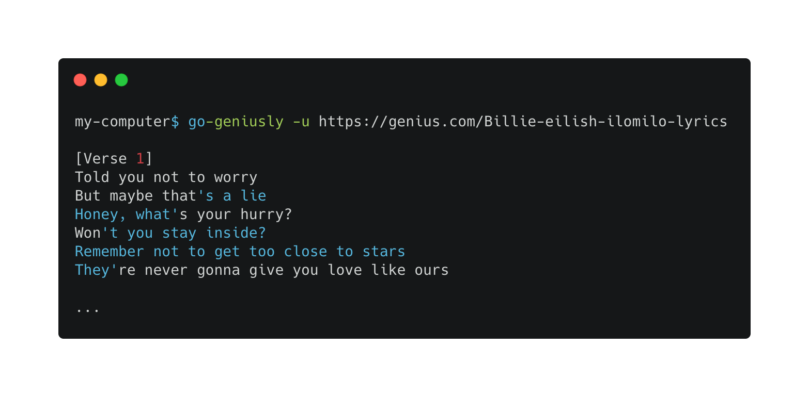

# go-geniusly
Golang cli app that returns lyrics form genius.com based in the url



#### To make it work:
```bash
go get github.com/davidmoca97/go-geniusly
```
```bash
go-geniusly -u urlOfTheGeniusPage
```

#### Flags
| flag   | description                                     |   |   |   |
|--------|-------------------------------------------------|---|---|---|
| url    | URL of the lyrics of the song on genius.com     |   |   |   |
| output | Path of the file where the lyrics will be saved |   |   |   |
| help   | Help! 😰                                         |   |   |   |

